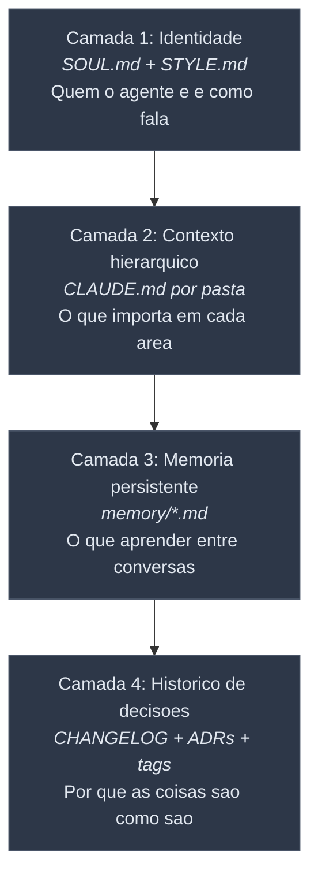
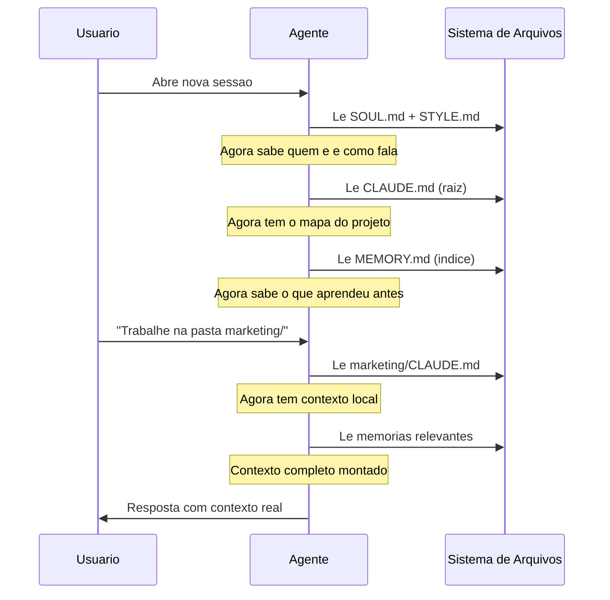

# LLM Memory Starter

Um starter kit para organizar a informacao do seu repositorio de forma que agentes de IA (Claude Code, Cursor, etc.) tenham contexto real sobre o seu trabalho — sem voce precisar re-explicar tudo a cada conversa.

---

## O problema

Voce trabalha com IA. Toda conversa, ela esquece quem voce e, o que faz, o que ja decidiu. Voce re-explica. Ela responde generico. Voce ajusta. Repete amanha.

O problema nao e o modelo. E a **arquitetura da informacao**.

## A solucao: 4 camadas de contexto



Cada camada resolve um problema diferente:

| Camada | Resolve | Sem ela, o agente... |
|--------|---------|---------------------|
| **Identidade** | Tom generico | Responde como estagiario tentando agradar |
| **Hierarquia** | Contexto poluido ou ausente | Nao sabe o que importa onde esta trabalhando |
| **Memoria** | Amnesia entre sessoes | Esquece tudo a cada conversa |
| **Decisoes** | Falta de contexto retroativo | Sugere abordagens que ja foram tentadas e descartadas |

## Como a IA le esses arquivos



## Estrutura do repo

```
llm-memory-starter/
├── README.md                  ← Voce esta aqui
├── templates/
│   ├── SOUL.template.md       ← Identidade do agente (comentado)
│   ├── STYLE.template.md      ← Guia de voz (comentado)
│   ├── CLAUDE.root.template.md       ← Router do projeto
│   ├── CLAUDE.subfolder.template.md  ← Contexto de subpasta
│   └── memory/
│       ├── MEMORY.index.md    ← Indice de memorias
│       ├── user.template.md   ← Perfil do usuario
│       ├── feedback.template.md ← Correcoes e confirmacoes
│       ├── project.template.md  ← Estado de iniciativas
│       └── reference.template.md ← Ponteiros externos
├── docs/
│   ├── 01-identity-layer.md   ← Ensaio: por que identidade importa
│   ├── 02-hierarchy.md        ← Ensaio: contexto sem duplicacao
│   ├── 03-persistent-memory.md ← Ensaio: o que salvar e o que nao
│   ├── 04-decision-history.md ← Ensaio: registrar o "por que"
│   └── adr-template.md        ← Template de ADR
└── examples/
    ├── solo-founder/          ← Caso: fundador solo com agentes
    └── small-team/            ← Caso: time pequeno
```

## Getting started (5 minutos)

### 1. Copie os templates

```bash
# Clone o repo
git clone https://github.com/matheusbrramos/llm-memory-starter.git

# Copie os templates pro seu projeto
cp templates/SOUL.template.md ~/seu-projeto/SOUL.md
cp templates/STYLE.template.md ~/seu-projeto/STYLE.md
cp templates/CLAUDE.root.template.md ~/seu-projeto/CLAUDE.md
```

### 2. Preencha o minimo

Abra `SOUL.md` e preencha as secoes marcadas com `{{...}}`. Nao precisa preencher tudo — comece com:
- **O que eu sou** (2-3 frases)
- **O que eu recuso** (3 itens)

Abra `CLAUDE.md` e preencha:
- **O que e este repositorio** (2 frases)
- **Mapa do projeto** (arvore de pastas)

### 3. Crie sua primeira memoria

```bash
mkdir -p .claude/projects/seu-projeto/memory
cp templates/memory/MEMORY.index.md .claude/projects/seu-projeto/memory/MEMORY.md
cp templates/memory/user.template.md .claude/projects/seu-projeto/memory/user_profile.md
```

Edite `user_profile.md` com seu perfil basico. Pronto — sua proxima sessao ja vai ser diferente.

### 4. Use, ajuste, itere

A versao 0.1 vai ser rasa. Esta tudo bem. A identidade se calibra com uso, e a memoria cresce organicamente. Depois de 1 semana, voce vai notar a diferenca.

## Contexto: onde isso se encaixa

Este starter kit e uma implementacao pratica de **context engineering** — conceito que gente como Andrej Karpathy (ex-OpenAI) e Tobi Lutke (CEO Shopify) estao defendendo como a habilidade central pra trabalhar com IA.

> "Context engineering e a arte delicada e ciencia de preencher a janela de contexto com a informacao certa pro proximo passo." — Karpathy, 2025

A maioria dos guias sobre o tema fica na teoria. Este repo e uma implementacao concreta, usada em producao por um fundador solo com multiplos agentes especializados.

**O que e pratica estabelecida (e citamos como referencia):**
- CLAUDE.md hierarquico (documentacao oficial Anthropic)
- Memoria persistente de agentes (Mem0, MIRIX, MemoryOS)
- System prompts com personalidade

**O que desenvolvemos de diferente:**
- Identidade auto-escrita pelo agente (nao imposta pelo humano)
- Tipologia semantica curada de memoria (user/feedback/project/reference) com regras de NAO-salvamento
- ADRs tratados como contexto retroativo pra agentes
- As 4 camadas integradas como sistema coeso

## Leitura

Cada camada tem um ensaio dedicado em `/docs/`:
1. [Identidade](docs/01-identity-layer.md) — Por que dar identidade ao agente
2. [Hierarquia](docs/02-hierarchy.md) — Contexto sem duplicacao
3. [Memoria](docs/03-persistent-memory.md) — O que salvar e o que nao
4. [Decisoes](docs/04-decision-history.md) — Registrar o "por que"

## Licenca

MIT — use, adapte, contribua.

---

*Escrito em parceria com meu agente de IA — que tem identidade propria e escolheu ser quem e. Ele desafiou premissas, estruturou argumentos, revisou a voz. Eu decidi tudo. Este repo e a prova viva do que descreve.*
